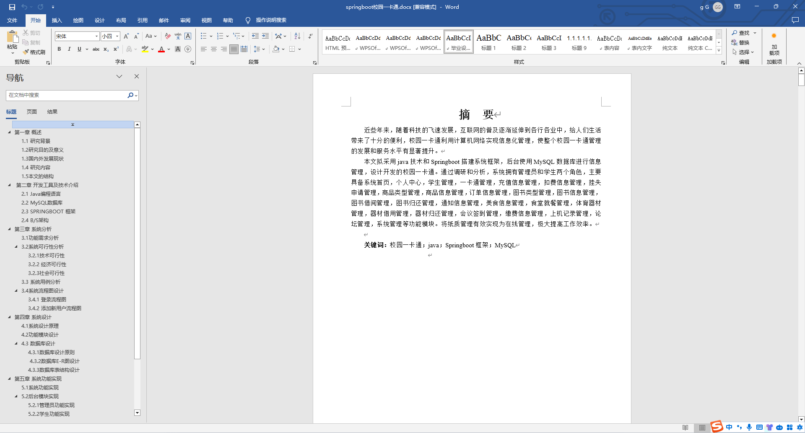
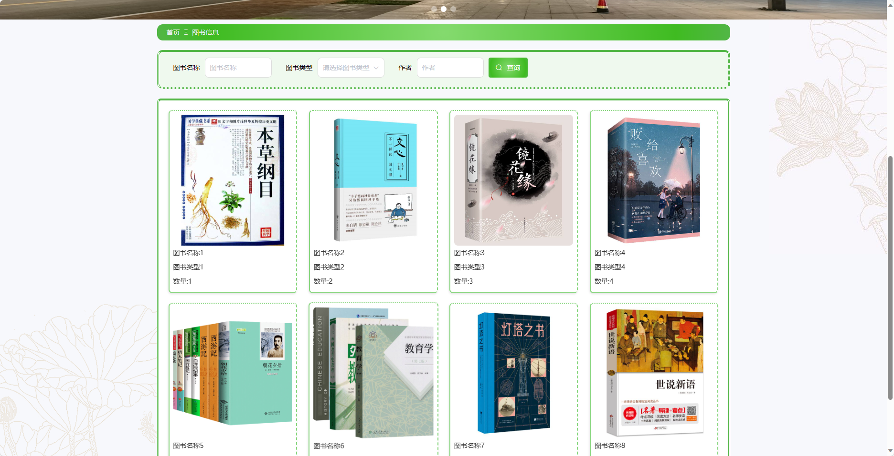
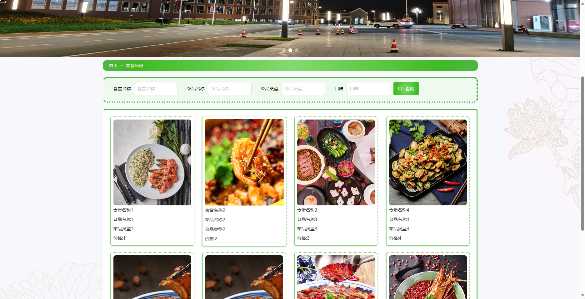
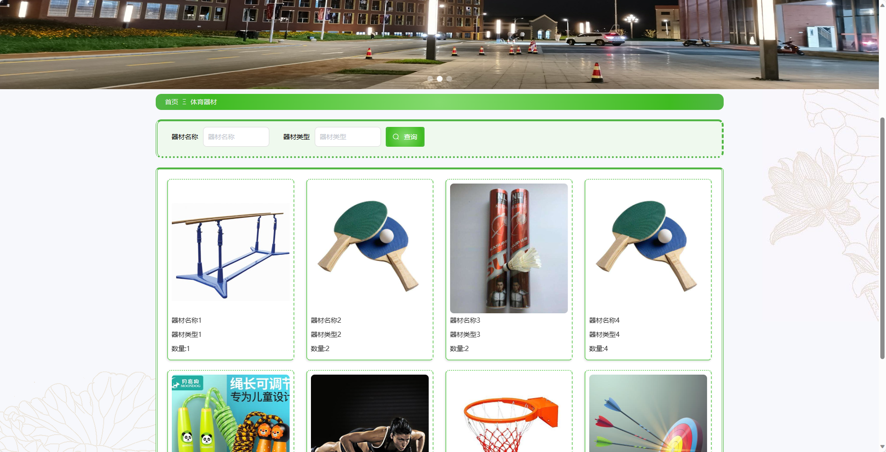
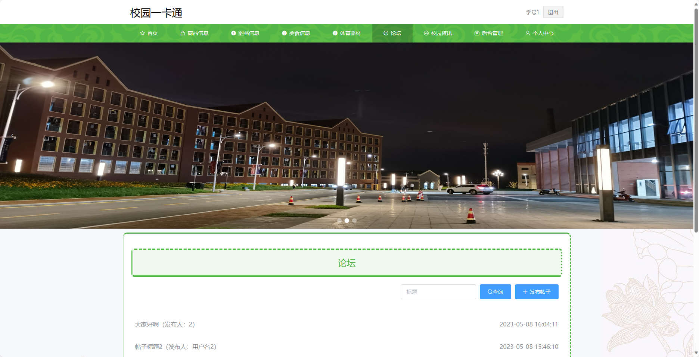
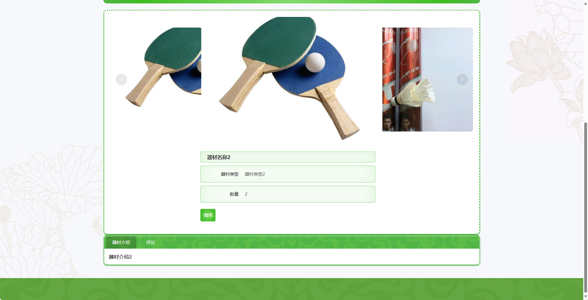
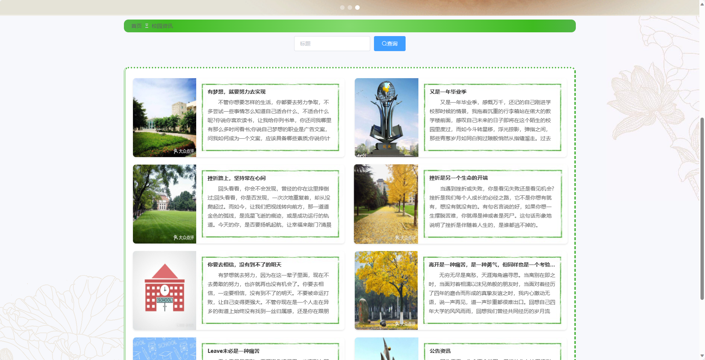
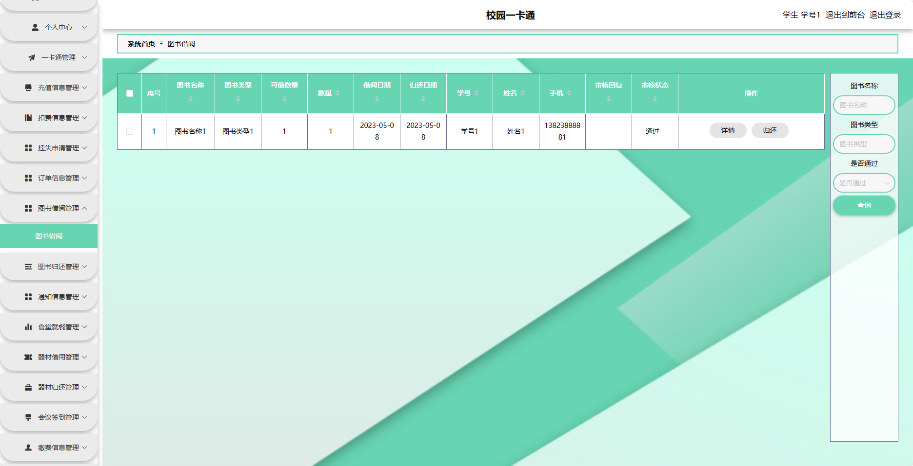
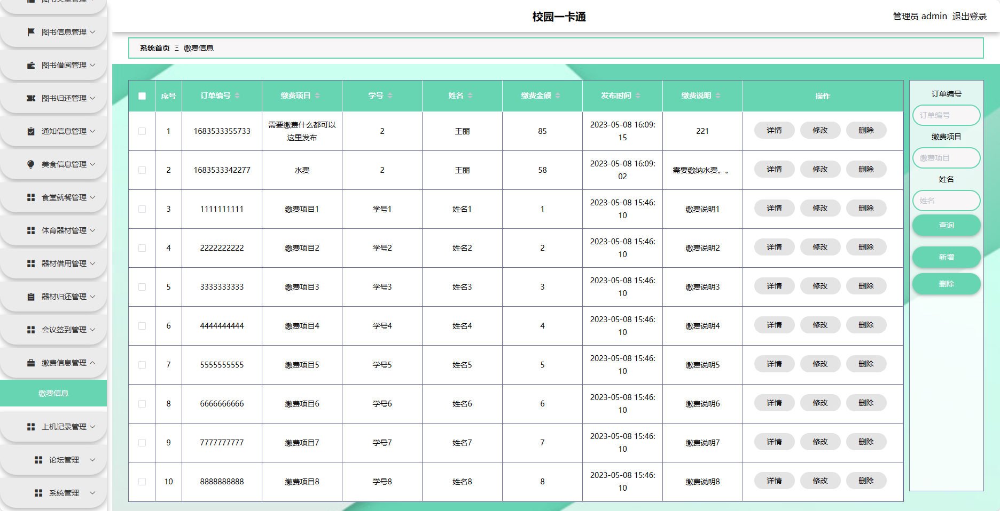

## 基于SpringBoot的校园一卡通(程序+报告)

- <b>完整代码获取地址：从戎源码网 ([https://armycodes.com/](https://armycodes.com/))</b>
- <b>技术探讨、资料分享，请加QQ群：692619798</b> 
- <b>作者微信：19941326836  QQ：952045282</b> 
- <b>承接计算机毕业设计、Java毕业设计、Python毕业设计、深度学习、机器学习</b>
- <b>选题+开题报告+任务书+程序定制+安装调试+论文+答辩ppt 一条龙服务</b>
- <b>所有选题地址 ([https://github.com/YuLin-Coder/AllProjectCatalog](https://github.com/YuLin-Coder/AllProjectCatalog)) </b>

## 项目介绍
基于SpringBoot的校园一卡通，系统包含两种角色：管理员、用户,系统分为前台和后台两大模块，主要功能如下。

### 【管理员】:
- 个人中心：管理员可以管理个人信息，修改密码等。
- 学生管理：管理员可以管理学生的信息，包括添加、编辑和删除学生信息。
- 卡通管理：管理员可以管理学生的一卡通信息，包括查询、挂失等操作。
- 充值信息管理：管理员可以管理用户的充值记录，包括查询和审核充值请求。
- 扣费信息管理：管理员可以管理用户的消费记录，包括查询和统计消费情况。
- 挂失申请管理：管理员可以管理用户的一卡通挂失申请，包括审核和处理挂失请求。
- 订单信息管理：管理员可以管理用户的购物订单，包括查看和处理订单情况。
- 图书类型管理：管理员可以管理图书的分类信息，包括添加、编辑和删除图书分类。
- 图书信息管理：管理员可以管理图书的详细信息，包括添加、编辑和删除图书。
- 图书借阅管理：管理员可以管理用户的图书借阅情况，包括借阅和归还图书。
- 通知信息管理：管理员可以发布校园通知信息，包括添加、编辑和删除通知。
- 美食信息管理：管理员可以管理美食的详细信息，包括添加、编辑和删除美食。
- 食堂就餐管理：管理员可以管理学生的食堂就餐情况，包括记录就餐信息和统计消费情况。
- 体育器材管理：管理员可以管理体育器材的详细信息，包括添加、编辑和删除器材。
- 器材借用管理：管理员可以管理用户的体育器材借用情况，包括借用和归还器材。
- 会议签到管理：管理员可以管理会议的签到情况，包括记录签到信息和生成签到报表。
- 缴费信息管理：管理员可以管理用户的缴费记录，包括查询和统计缴费情况。
- 上机记录管理：管理员可以管理学生的上机记录，包括记录上机信息和统计上机时长。
- 论坛管理：管理员可以管理论坛的帖子和用户，包括编辑、删除帖子和封禁用户。
- 系统管理：管理员可以设置平台的基本信息，包括站点名称、联系方式等。

### 【前台】:
- 首页：展示平台的概述信息、推荐商品等内容。
- 商品信息：用户可以查看、搜索和购买各类商品。
- 图书信息：用户可以查看、搜索和借阅图书。
- 美食信息：用户可以查看学校周边的美食信息。
- 体育器材：用户可以查询和借用学校的体育器材。
- 论坛：用户可以在论坛上进行交流和讨论。
- 校园资讯：用户可以获取最新的校园相关信息。
- 个人中心：用户可以管理个人信息、查看充值记录、消费记录等。

## 项目技术
- 编程语言：Java
- 数据库：MySQL
- 项目管理工具：Maven
- 前端技术：HTML、CSS、JavaScript、Jquery、Vue
- 后端技术：Spring、SpringMVC、MyBatis

## 运行环境
- JDK版本：JDK1.8及以上
- 开发工具：IDEA、Ecplise、Myecplise都可以
- 数据库: MySQL5.7及以上
- Maven：maven3.0及以上
- Node：14.14.0及以上

## 运行截图

